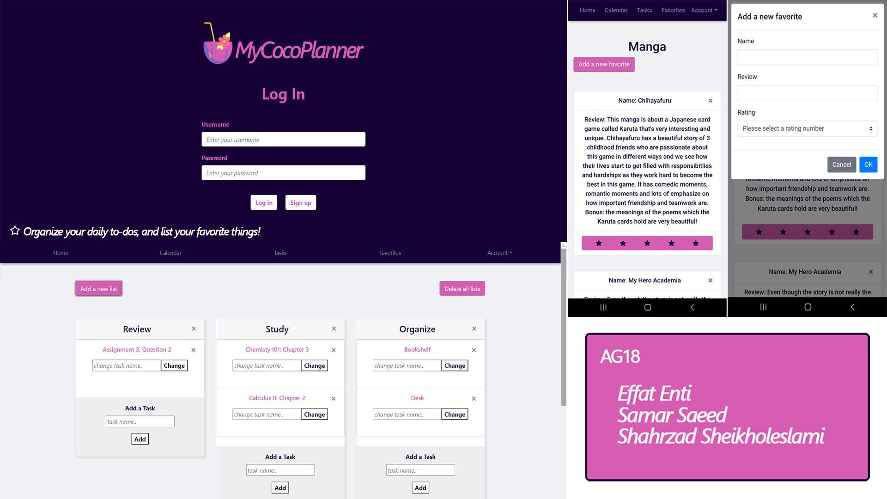

# Backend and Frontend Template

Latest version: https://git.ita.chalmers.se/courses/dit341/group-00-web (public Github [mirror](https://github.com/dit341/group-00-web))

## Project Structure

| File        | Purpose           | What you do?  |
| ------------- | ------------- | ----- |
| `server/` | Backend server code | All your server code |
| [server/README.md](server/README.md) | Everything about the server | **READ ME** carefully! |
| `client/` | Frontend client code | All your client code |
| [client/README.md](client/README.md) | Everything about the client | **READ ME** carefully! |
| [docs/DEPLOYMENT.md](docs/DEPLOYMENT.md) | Free online production deployment | Deploy your app online in production mode |
| [docs/LOCAL_DEPLOYMENT.md](docs/LOCAL_DEPLOYMENT.md) | Local production deployment | Deploy your app local in production mode |

## Requirements

The version numbers in brackets indicate the tested versions but feel free to use more recent versions.
You can also use alternative tools if you know how to configure them (e.g., Firefox instead of Chrome).

* [Git](https://git-scm.com/) (v2) => [installation instructions](https://www.atlassian.com/git/tutorials/install-git)
  * [Add your Git username and set your email](https://docs.gitlab.com/ce/gitlab-basics/start-using-git.html#add-your-git-username-and-set-your-email)
    * `git config --global user.name "YOUR_USERNAME"` => check `git config --global user.name`
    * `git config --global user.email "email@example.com"` => check `git config --global user.email`
  * > **Windows users**: We recommend to use the [Git Bash](https://www.atlassian.com/git/tutorials/git-bash) shell from your Git installation or the Bash shell from the [Windows Subsystem for Linux](https://docs.microsoft.com/en-us/windows/wsl/install-win10) to run all shell commands for this project.
* [Chalmers GitLab](https://git.ita.chalmers.se/) => Login with your **Chalmers CID** choosing "Sign in with" **Chalmers Login**. (contact [support@chalmers.se](mailto:support@chalmers.se) if you don't have one)
  * DIT341 course group: https://git.ita.chalmers.se/courses/dit341
  * [Setup SSH key with Gitlab](https://docs.gitlab.com/ee/ssh/)
    * Create an SSH key pair `ssh-keygen -t ed25519 -C "email@example.com"` (skip if you already have one)
    * Add your public SSH key to your Gitlab profile under https://git.ita.chalmers.se/profile/keys
    * Make sure the email you use to commit is registered under https://git.ita.chalmers.se/profile/emails
  * Checkout the [Backend-Frontend](https://git.ita.chalmers.se/courses/dit341/group-00-web) template `git clone git@git.ita.chalmers.se:courses/dit341/group-00-web.git`
* [Server Requirements](./server/README.md#Requirements)
* [Client Requirements](./client/README.md#Requirements)

## Getting started

```bash
# Clone repository
git clone git@git.ita.chalmers.se:courses/dit341/group-00-web.git

# Change into the directory
cd group-00-web

# Setup backend
cd server && npm install
npm run dev

# Setup frontend
cd client && npm install
npm run serve
```

> Check out the detailed instructions for [backend](./server/README.md) and [frontend](./client/README.md).

## Visual Studio Code (VSCode)

Open the `server` and `client` in separate VSCode workspaces or open the combined [backend-frontend.code-workspace](./backend-frontend.code-workspace). Otherwise, workspace-specific settings don't work properly.

## System Definition (MS0)

### Purpose

MyCocoPlanner is a digital planner that aims to help you manage your life and express your own individuality creatively.

Just like paper planners, MyCocoPlanner helps you to keep track of your weekly tasks, habits, budget, to-dos, shopping list, and other aspects of your life (e.g. books or things you are passionate about). The benefit of using planners is that they make us more self-aware, and increase our productivity which gives us a feeling of fulfillment that leads to a happier life. 

You don’t want to use pen and paper? Want an environmentally friendly software? This planner could be the thing you’re looking for!


### Pages

* Register/Sign-up page: The start page starts with a register or login box where users can login or create an account. After the user has successfully created an account with an email, the system will redirect the user to the homepage. 
* Homepage:   The homepage allows the user to create planners and displays the list of planners the user has created. The user can choose a planner from the list and the system will redirect the user to the planner page. 
* Planner page: The planner has three different sections. Weekly planning, My favourites and Calendar.
* Weekly planning: The weekly planner page has different types of list, for example,weekly planning, habit tracker, menu where the user can edit, save and keep track of their weekly tasks, food habits, budgets, shopping items etc. The user can also write personalised notes on the page. 
* Calendar
* My favourites: The user can note their favourite books, movies or games here along with review, ratings and opinions. 
* Profile page: This is the account page where the user’s personal data such as username, email, profile photo, and etc. are saved, and the user can edit or change their username or profile picture. 
* Settings page: The settings page will allow the user to customize the planner and change the theme, font and color, language, date/time format of MyCocoPlanner.


### Entity-Relationship (ER) Diagram


## Teaser (MS3)


