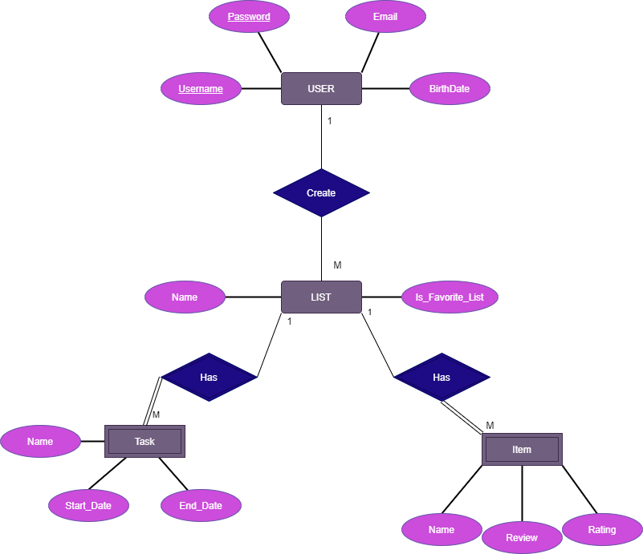

# Backend and Frontend Template

## Project Structure

| File        | Purpose           | It's contents  |
| ------------- | ------------- | ----- |
| `server/` | Backend server code | All the server code |
| [server/README.md](server/README.md) | Everything about the server |  |
| `client/` | Frontend client code | All the client code |
| [client/README.md](client/README.md) | Everything about the client |  |
| [docs/DEPLOYMENT.md](docs/DEPLOYMENT.md) | Free online production deployment | Document on how to deploy the app |
| [docs/LOCAL_DEPLOYMENT.md](docs/LOCAL_DEPLOYMENT.md) | Local production deployment | Document on how to deploy the app local in production mode |

## Requirements

The version numbers in brackets indicate the tested versions

* [Git](https://git-scm.com/) (v2) => [installation instructions](https://www.atlassian.com/git/tutorials/install-git)
  * [Add your Git username and set your email](https://docs.gitlab.com/ce/gitlab-basics/start-using-git.html#add-your-git-username-and-set-your-email)
    * `git config --global user.name "YOUR_USERNAME"` => check `git config --global user.name`
    * `git config --global user.email "email@example.com"` => check `git config --global user.email`
  * > **Windows users**: We recommend to use the [Git Bash](https://www.atlassian.com/git/tutorials/git-bash) shell from your Git installation or the Bash shell from the [Windows Subsystem for Linux](https://docs.microsoft.com/en-us/windows/wsl/install-win10) to run all shell commands for this project.
  * [Setup SSH key with Gitlab](https://docs.gitlab.com/ee/ssh/)
    * Create an SSH key pair `ssh-keygen -t ed25519 -C "email@example.com"` (skip if you already have one)
    * Add your public SSH key to your Gitlab profile under https://git.ita.chalmers.se/profile/keys
    * Make sure the email you use to commit is registered under https://git.ita.chalmers.se/profile/emails
* [Server Requirements](./server/README.md#Requirements)
* [Client Requirements](./client/README.md#Requirements)

## Getting started

```bash
# Clone repository
git clone git@github.com:efenaty/CocoPlanner.git

# Change into the directory
cd CocoPlanner

# Setup backend
cd server && npm install
npm run dev

# Setup frontend
cd client && npm install
npm run serve
```

> Check out the detailed instructions for [backend](./server/README.md) and [frontend](./client/README.md).

## Visual Studio Code (VSCode)

Open the `server` and `client` in separate VSCode workspaces or open the combined [backend-frontend.code-workspace](./backend-frontend.code-workspace). Otherwise, workspace-specific settings don't work properly.

## System Definition (MS0)

### Purpose

_**MyCocoPlanner**_ is a digital planner that aims to help you manage and organize your daily to-dos, and list your favorite things!

Just like paper planners, MyCocoPlanner helps you to keep track of your weekly tasks, habits, budget, to-dos, shopping list, and other aspects of your life (e.g. books or things you are passionate about). The benefit of using planners is that they make us more self-aware, and increase our productivity which gives us a feeling of fulfillment that leads to a happier life. 

You don’t want to use pen and paper? Want an environmentally friendly software? This planner could be the thing you’re looking for! 


### Pages

* **Register/Sign-up page:** The start page starts with a register or login box where users can login or create an account. After the user has successfully created an account with an email, the system will redirect the user to the homepage. 
* **Homepage:** The homepage allows the user to create to-do lists or my-favorites lists, or  display the existing lists the user has already created. 
* **Profile settings:** This is the account page where the user’s personal data such as username, email, password, etc. are saved, and the user can edit or change their account details via this page. 


### Entity-Relationship (ER) Diagram



## Teaser (MS3)


